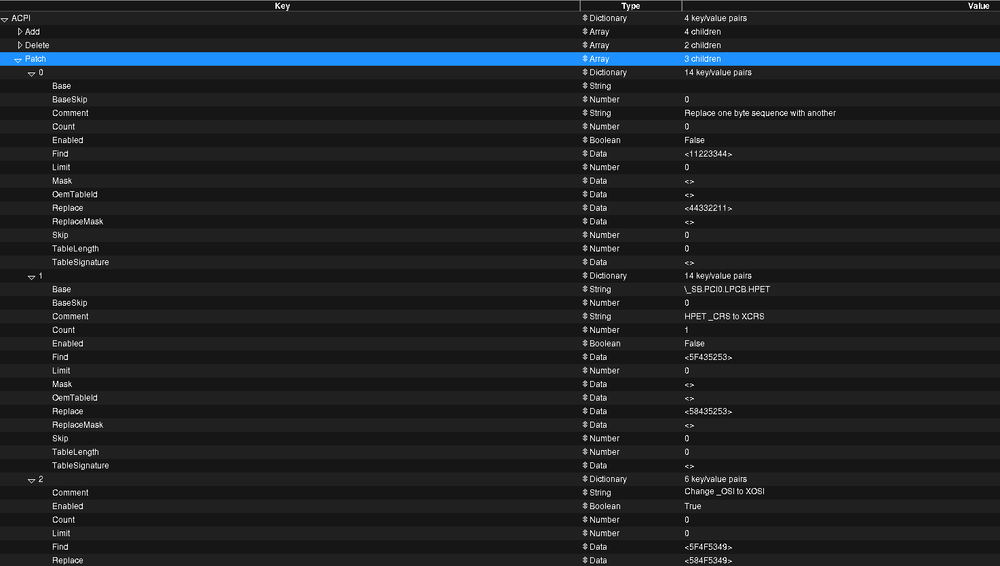
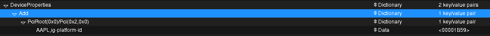
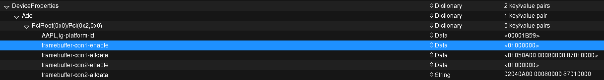
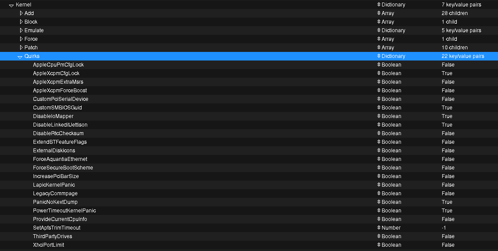

Disappointed with Windows 11, I decided to install MacOS on my Dell XPS 13 9360. This post records the process of installing MacOS on my laptop. I will update it as I learn more about Hackintosh.

# Before Install

## My Device Specs

**CPU:** Intel(R) Core(TM) i7-7500U CPU @ 2.70GHz

**Graphics:** 00:02.0 VGA compatible controller: Intel Corporation HD Graphics 620 (rev 02)

**Chipset**: 0VPVXX

- Motherboard details
    
    Handle 0x0002, DMI type 2, 15 bytes
    Base Board Information
    Manufacturer: Dell Inc.
    Product Name: 0VPVXX
    Version: A01
    Serial Number: /429HSF2/CNCMK0088DA027/
    Asset Tag: Not Specified
    Features:
    Board is a hosting board
    Board is replaceable
    Location In Chassis: Not Specified
    Chassis Handle: 0x0300
    Type: Motherboard
    Contained Object Handles: 0
    
    Handle 0x001C, DMI type 10, 6 bytes
    On Board Device Information
    Type: Video
    Status: Enabled
    Description: "Intel HD Graphics"
    
    Handle 0x0033, DMI type 41, 11 bytes
    Onboard Device
    Reference Designation:  Onboard IGD
    Type: Video
    Status: Enabled
    Type Instance: 1
    Bus Address: 0000:00:02.0
    
    Handle 0x0034, DMI type 41, 11 bytes
    Onboard Device
    Reference Designation:  Onboard LAN
    Type: Ethernet
    Status: Enabled
    Type Instance: 1
    Bus Address: 0000:00:19.0
    
    Handle 0x0035, DMI type 41, 11 bytes
    Onboard Device
    Reference Designation:  Onboard 1394
    Type: Other
    Status: Enabled
    Type Instance: 1
    Bus Address: 0000:03:1c.2
    

Touchpad: DLL075B

**RAM:** 16GB LPDDR3 (1866MHz)

**Storage:** ~~TOSHIBA THNSN5512GPUK 512GB PCIe m.2 SSD~~

- Replaced with WD Black SN750 NVMe

**Ports:** 1 x USB 3.0, 1 x USB 3.0 w/PowerShare, 1 x USB-C (Thunderbolt 3), SD card reader, headphone jack

**WLAN/Bluetooth:** ~~Qualcomm Killer 1535 802.11ac Wi-Fi; Bluetooth 4.1~~ 

- *replaced with* BCM94352Z_DELL (DW1560)

****Keyboard and Trackpad Connection Type****

Idk yet, now assume it to be ps/2

- Trackpad: `SMBus`
- Keyboard: `PS/2`

**Audio**

- Sunrise Point-LP HD Audio
├── Device ID: 0x9d71
├── Vendor: 0x8086
├── ACPI Path: \*SB*.PCI0.HDAS
├── PCI Path: PciRoot(0x0)/Pci(0x1f,0x3)
└── Codec: ALC3246

## Terminology

- **UEFI**: The Unified Extensible Firmware Interface (UEFI) is a **specification** that defines a **software interface between an operating system and platform firmware**. UEFI replaces the legacy Basic Input/Output System (BIOS) firmware interface originally present in all IBM PC-compatible personal computers, with most UEFI firmware implementations providing support for legacy BIOS services. UEFI can support remote diagnostics and repair of computers, even with no operating system installed.
- **UEFI Drivers**: Like any other OS, UEFI has drivers and they're loaded by Clover or OpenCore. They're also meant to load devices or perform other tasks, like loading Apple's HFS drives with HfsPlus.efi, patching macOS's `boot.efi` and so on. You may find them as `Clover Drivers` or `OpenCore Drivers`, they're all UEFI drivers.
- **EFI**: It can denote two things:
    - Mac's firmware, which is the same as UEFI, but pretty modified for Macs only, so not so "Universal"
    - The partition on your hard drive that stores software read by the UEFI to load OSes (like the Windows bootloader) or UEFI Applications (like OpenCore), it's FAT32 formatted and has an ID type of `EF00`(in hex). It can be named ESP or SYSTEM, and it's usually from 100MB to 400MB in size but the size doesn't reflect upon anything.
- **[ACPI](https://dortania.github.io/Getting-Started-With-ACPI/#a-quick-explainer-on-acpi)**: The Advanced Configuration and Power Interface (ACPI) provides an open standard that operating systems can use to discover and configure computer hardware components, more of this will be discussed later in the guide.
    - A **DSDT**(Differentiated System Description Table) can be seen as the body holding most of the info with smaller bits of info being passed by the **SSDT**(Secondary System Description Table). You can think of the DSDT as the building blueprints with SSDTs being sticky notes outlining extra details to the project

# Install

## 1. USB Mapping

MacOS has a [15 port limits](https://dortania.github.io/OpenCore-Post-Install/usb/), but your mother board may have more ports. This mismatch may cause problems like data corruption. Therefore, we need to map the ports before installing the MacOS.

As warned [here](https://dortania.github.io/OpenCore-Install-Guide/installer-guide/linux-install.html#downloading-macos), if we are installing macOS 11.3 and newer, we’d better map the USB ports before installing it. The [guide](https://dortania.github.io/OpenCore-Post-Install/usb/) from opencore is for post install, also [USBMap](https://github.com/corpnewt/USBMap) works only on macOS. I found this [post](https://www.reddit.com/r/hackintosh/comments/ta1ef4/guide_easy_usb_mapping_with_usbtoolbox_on_windows/) that introduces [USBToolBox](https://github.com/USBToolBox/tool) as a way to map USB ports in Windows. Following the post or the github page of USBToolBox to complete USB mapping. At this stage, the gola is to limit the number of ports within fifteen. You can reconfigure it after macOS is installed. Therefore it is acceptable if you didn’t configure it all right.

Note that you will get a `UTBMap.kext` file after the above steps. Save it somewhere so that you can later copy it to your USB installer.

## 2. Create USB installer

There are several ways to do it, you can follow the [guide](https://dortania.github.io/OpenCore-Install-Guide/installer-guide/) from OpenCore. I created a online installer with Linux. If you’d like an offline installer, you can only create it with an existing macOS. Consult [the guide](https://dortania.github.io/OpenCore-Install-Guide/installer-guide/linux-install.html#downloading-macos) for more details.

1. Download macOS recovery
    
    ```bash
    cd ~/Downloads
    # Download OpenCorePkg (this might not be the newest version!)
    wget https://github.com/acidanthera/OpenCorePkg/releases/download/0.8.9/OpenCore-0.8.9-DEBUG.zip
    # Adjust below command to the correct folder
    cd ~/Downloads/OpenCore-0/Utilities/macrecovery/
    # Download Monterey
    python3 ./macrecovery.py -b Mac-FFE5EF870D7BA81A -m 00000000000000000 download
    ```
    
    In my case, the recovery medias are located under `~/Downloads/OpenCore-0.8.9-DEBUG/Utilities/macrecovery/com.apple.recovery.boot/`, it includes:
    
    - BaseSystem.dmg
    - BaseSystem.chunklist
2. Make the installer
    1. use `lsblk` to get your USB device name. Mine is `/dev/sda1`
    2. Create GPT partition on your drive
        
        ```bash
        sudo gdisk /dev/<your USB block>
        # If prompted with 3 options, choose "3 - Create blank GPT"
        # Clear the partition table and make a new GPT one
        > o
        	> y # confirm
        # Create new partitions
        > n
        	> partition number: (default)
        	> first sector: (default)
        	> last sector: (default)
        	> Hex code or GUID: 0700
        # Write partitions
        > w
        	> y # confirm
        ```
        
    3. Format the USB to FAT32
        
        `sudo mkfs.vfat -F 32 -n "OPENCORE" /dev/<your USB partition block>`
        
    4. mount the USB
        
        `udisksctl mount -b /dev/<your USB partition block>`
        
    5. Copy the macOS recovery. In my case, the downloaded files are at `~/Downloads/OpenCore-0.8.9-DEBUG/Utilities/macrecovery/com.apple.recovery.boot/`
        
        ```bash
        cp -r /path/to/OpenCore/Utilities/macrecovery/com.apple.recovery.boot/ /media/<username>/OPENCORE
        ```
        

## 3. Prepare Opencore files

1. Download the [latest release](https://github.com/acidanthera/OpenCorePkg/releases) from OpenCorePkg repository. The one ends with DEBUG give more information in case of failures.
2. Unzip it, copy the `EFI` folder under `x64` folder to the root of your USB boot drive `OPENCORE`
3. Remove unnecessary drivers and tools, keep only `OC/Drivers/OpenRuntime.efi` and `OC/Tools/OpenShell.efi`
    
    ```bash
    cd path/to/OPENCORE/EFI/OC
    mv Drivers/OpenRuntime.efi ./
    rm Drivers/*
    > y
    mv OpenRuntime.efi Drivers/
    mv Tools/OpenShell.efi ./
    rm Tools/*
    > y
    mv OpenShell.efi Tools/
    ```
    
4. Copy the USB map kext to `Kexts` folder

## 4. Gather related files for your device

Gather necessary files following [instructions](https://dortania.github.io/OpenCore-Install-Guide/ktext.html#universal). Extra files apart from those come with OpenCorePkg are as follows. They should be placed within respected folders under `OC`.

### Drivers

- **[HfsPlus.efi](https://github.com/acidanthera/OcBinaryData/blob/master/Drivers/HfsPlus.efi)**

### Kexts

**Categories**

- **[Lilu](https://github.com/acidanthera/Lilu/releases)** (copy only the `Lilu.kext` file)
- **[VirtualSMC](https://github.com/acidanthera/VirtualSMC/releases)**
- VirtualSMC Plugins including (optional):
    - SMCBatteryManager.kext
    - SMCDellSensors.kext
- **[WhateverGreen](https://github.com/acidanthera/WhateverGreen/releases)**: graphics support
- **[AppleALC](https://github.com/acidanthera/AppleALC/releases):** audio support (copy AppleALCU.kext only)
- [USBToolBox/kext](https://github.com/USBToolBox/kext): USB mapping support
- **For WLAN/Bluetooth**
    - **[AirportBrcmFixup](https://github.com/acidanthera/AirportBrcmFixup/releases)** (need extra to disable AirPortBrcm4360 for BigSur)
    - **[BrcmPatchRAM](https://github.com/acidanthera/BrcmPatchRAM/releases)** (this one is tricky, I’m not sure which to choose)
        - BrcmBluetoothInjector.kext
        - BrcmFirmwareData.kext
        - BrcmPatchRAM3.kext
        - Not sure about BlueToolFixup.kext

****Extras****

- **[AppleMCEReporterDisabler](https://github.com/acidanthera/bugtracker/files/3703498/AppleMCEReporterDisabler.kext.zip)**
- **[NVMeFix](https://github.com/acidanthera/NVMeFix/releases)**
- **[RestrictEvents](https://github.com/acidanthera/RestrictEvents)**

**Inputs**

- **[VoodooPS2](https://github.com/acidanthera/VoodooPS2/releases)**: PS2 keyboards, mice, and trackpads
- ****I2C/USB HID Devices****
    - **[VoodooI2C](https://github.com/VoodooI2C/VoodooI2C/releases):** extract `…I2C` and `…HID`
- Misc
    - **[ECEnabler](https://github.com/1Revenger1/ECEnabler/releases)**: read battery status
    - **[BrightnessKeys](https://github.com/acidanthera/BrightnessKeys/releases)**: Fixes brightness keys automatically

### ****SSDTs****

> These are tables present in your firmware that outline hardware devices like USB controllers, CPU threads, embedded controllers, system clocks and such.
> 

We download prebuilt SSDTs from the web. My XPS 13 9360 Developer edition comes with a i7-7500u CPU. The codename of the CPU architecture is called `Kaby Lake`.

You can find what’s right for you [here](https://dortania.github.io/Getting-Started-With-ACPI/ssdt-methods/ssdt-prebuilt.html).

Download the following files and place them under `EFI/OC/ACPI`

- **[SSDT-PLUG-DRTNIA](https://github.com/dortania/Getting-Started-With-ACPI/blob/master/extra-files/compiled/SSDT-PLUG-DRTNIA.aml)**
- **[SSDT-EC-USBX-LAPTOP](https://github.com/dortania/Getting-Started-With-ACPI/blob/master/extra-files/compiled/SSDT-EC-USBX-LAPTOP.aml)**
- **[SSDT-PNLF](https://github.com/dortania/Getting-Started-With-ACPI/blob/master/extra-files/compiled/SSDT-PNLF.aml)**
- **[SSDT-XOSI](https://github.com/dortania/Getting-Started-With-ACPI/blob/master/extra-files/compiled/SSDT-XOSI.aml)**

## 5. Configure config.plist

 I follow this [tuorial](https://dortania.github.io/OpenCore-Install-Guide/config.plist/#creating-your-config-plist) and this [tutorial](https://dortania.github.io/OpenCore-Install-Guide/config-laptop.plist/kaby-lake.html#starting-point) for generating config.plist for my Kaby Lake laptop

### Initialize config.plist

Copy `Sample.plist` to `EFI/OC` and rename it to `config.plist`

### Load it into ProperTree

Use https://github.com/corpnewt/ProperTree to populate the config.plist

### Update each section

**ACPI**

Add and Delete can be left untouched. For Patch, I added  an item numbered 2 in the following picture.



**Booter**

- All sections can be left unchanged

**Device Properties**

- Add child `PciRoot(0x0)/Pci(0x2,0x0)`, set it as follow. Check [here](https://github.com/acidanthera/WhateverGreen/blob/master/Manual/FAQ.IntelHD.en.md#intel-uhd-graphics-610-650-kaby-lake-and-amber-lake-y-processors) for more information. The existing `PciRoot(0x0)/Pci(0x1b,0x0)` can be safely deleted, as it will be overwrite by the boot argument `alcid=xxx`. Check this [section](https://dortania.github.io/OpenCore-Install-Guide/config-laptop.plist/kaby-lake.html#add-2) for more details.
    
    
    
- As my graphic card is HD6xx, I need to further set values to fix display out.
    
    
    
    If the values above doesn’t work, try this set: con1 as 105, con2 as 306, HDMI and DP
    
    | Key | Type | Value |
    | --- | --- | --- |
    | framebuffer-con1-enable | Data | 01000000 |
    | framebuffer-con1-alldata | Data | 01050A00 00080000 87010000 |
    | framebuffer-con2-enable | Data | 01000000 |
    | framebuffer-con2-alldata | Data | 03060A00 00040000 87010000 |
- Delete**:** Can be ignored.

****[Kernel](https://dortania.github.io/OpenCore-Install-Guide/config-laptop.plist/kaby-lake.html#kernel)****

- Add, Emulate, Force, Block, Scheme: can be ignored
- Quirks, following the [instructions](https://dortania.github.io/OpenCore-Install-Guide/config-laptop.plist/kaby-lake.html#kernel), they are set as below.
    
    
    

**[Misc](https://dortania.github.io/OpenCore-Install-Guide/config-laptop.plist/kaby-lake.html#misc)**

- Security: set like this as [instructed](https://www.notion.so/Metrics-Datasets-94b4f5662a254e7889ba830a078896e1?pvs=21) (Do not skip)
    
    
    | Quirk | Enabled | Comment |
    | --- | --- | --- |
    | AllowSetDefault | YES |  |
    | BlacklistAppleUpdate | YES |  |
    | ScanPolicy | 0 |  |
    | SecureBootModel | Default | Leave this as Default for OpenCore to automatically set the correct value corresponding to your SMBIOS. The next page goes into more detail about this setting. |
    | Vault | Optional | This is a word, it is not optional to omit this setting. You will regret it if you don't set it to Optional, note that it is case-sensitive |
- Boot
    
    
    | Quirk | Enabled | Comment |
    | --- | --- | --- |
    | HideAuxiliary | YES | Press space to show macOS recovery and other auxiliary entries |
- Serial, Tools, Entries can be ignored

**NVRAM**

- Add:
    - boot args: `-v keepsyms=1 alcid=3246`
    - prev-lang:kbd: `<>`
- Delete
    - 

# Post Install

## USB Mapping

[r/hackintosh - GUIDE: Easy USB Mapping with USBToolbox on Windows](https://www.reddit.com/r/hackintosh/comments/ta1ef4/guide_easy_usb_mapping_with_usbtoolbox_on_windows/)

"Kext" stands for Kernel Extension; kext files "extend" Mac OS X's kernel, the core part of the operating system, by providing additional code to be loaded when your computer boots.

[Why should you USB map | OpenCore Post-Install](https://dortania.github.io/OpenCore-Post-Install/usb/)

## kext

[What are kexts?](http://www.macbreaker.com/2012/01/what-are-kexts.html)

## EFI Partition

[A Quick Guide To Your Hackintosh's EFI Partition](http://www.macbreaker.com/2016/02/a-quick-guide-to-your-hackintoshs-efi.html)

Apple originally used the EFI partition to help real Macs boot OS X (although real Macs don't really need it). Clover modifies the EFI partition so that regular PCs can use it to boot OS X as well.

# What I have done for debugging

- Enable two children in Booter → MmioWhitelist
- Enabel **AppleXcpmExtraMsrs**
